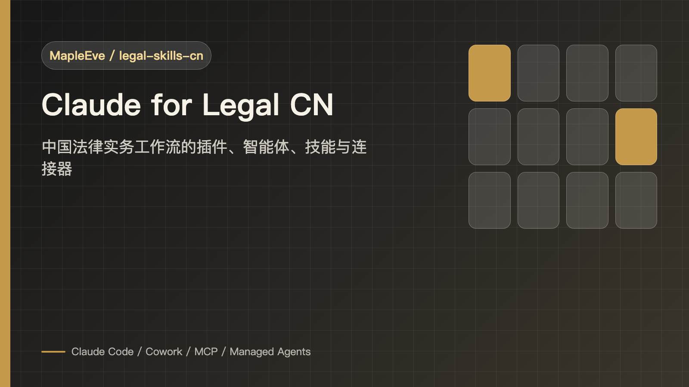
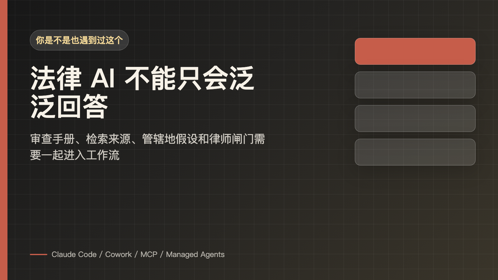
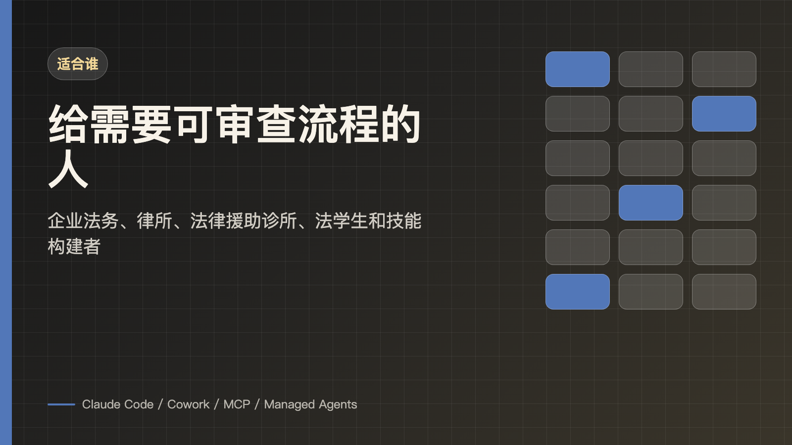
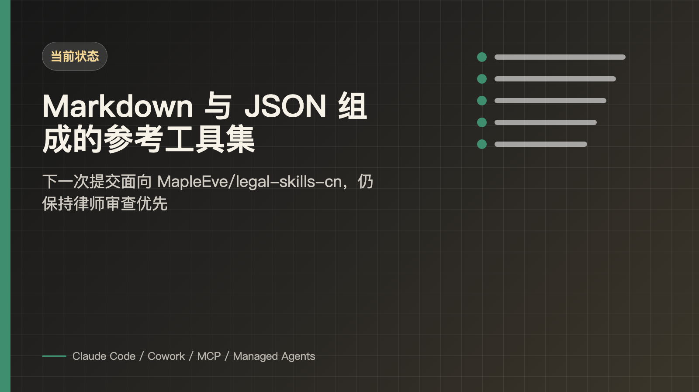
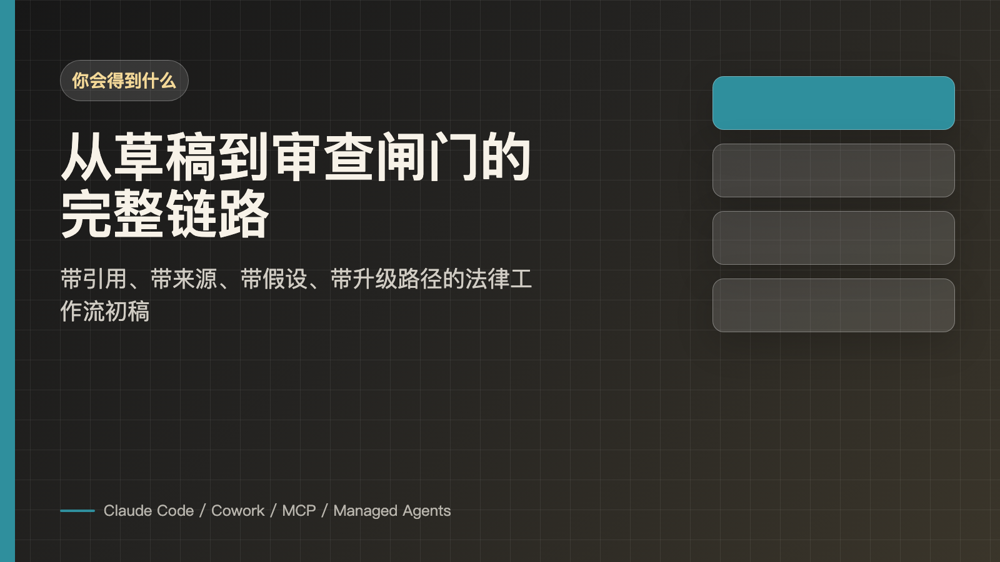
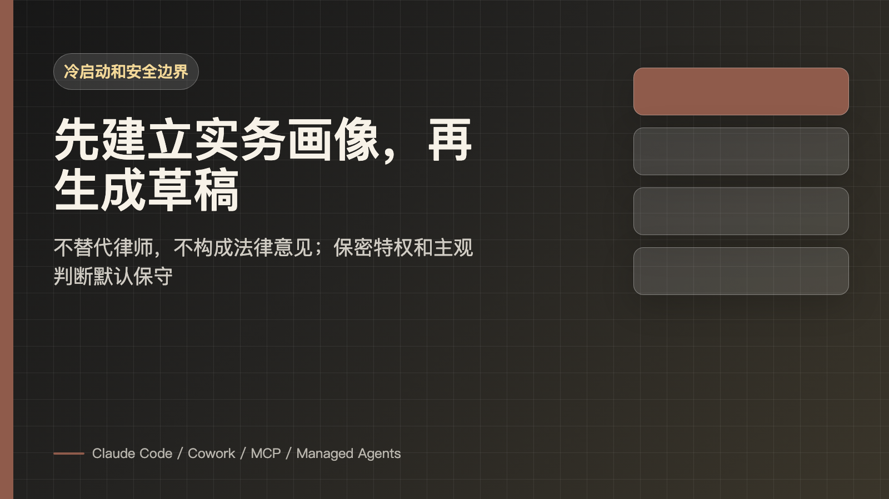
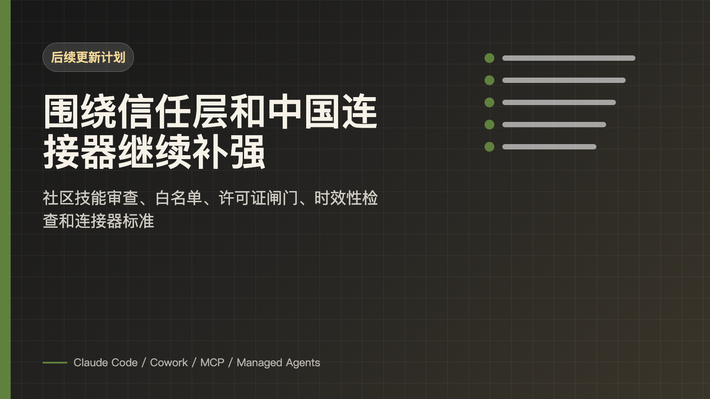
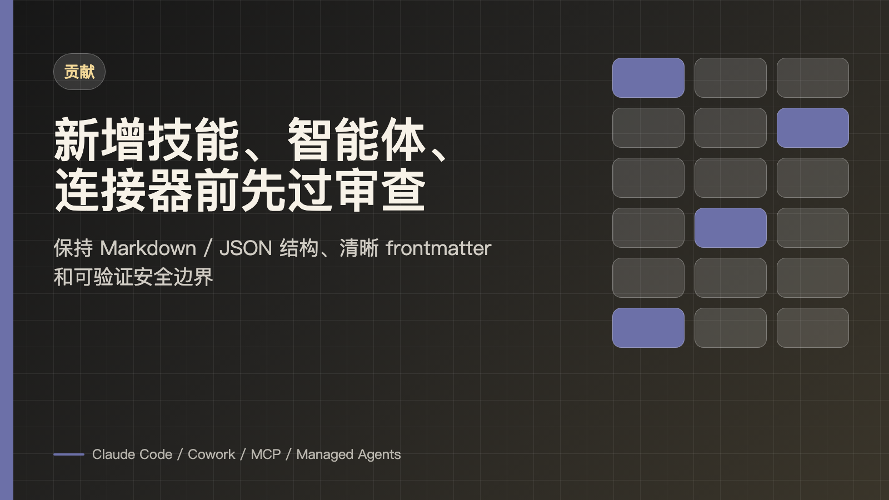
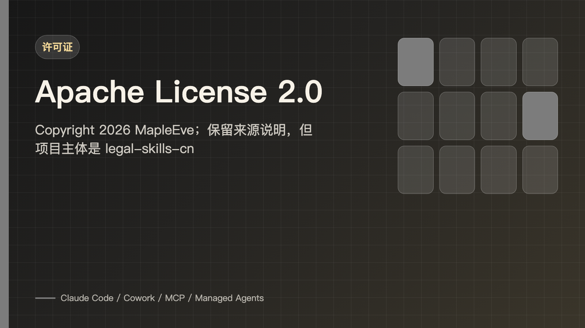

<sub>🌐 <b>简体中文</b></sub>

<div align="center">

# Claude for Legal CN ⚖️

> *「把法律工作流里的检索、草稿和审查闸门，放进同一套可复用技能。」*

<a href="https://github.com/MapleEve/legal-skills-cn">
  
</a>
<a href="https://claude.com/product/claude-code">
  
</a>
<a href="https://claude.com/product/cowork">
  
</a>
<a href="https://modelcontextprotocol.io/">
  
</a>
<a href="./LICENSE">
  
</a>

<br>
<br>



<br>

Claude for Legal CN 是 `MapleEve/legal-skills-cn` 面向中国法律实务的 AI 工具集。<br>
它覆盖企业法务、律所、争议解决、法律援助工作站、法学生训练和法律技能管理。<br>
所有输出都是供执业律师审查的草稿，不构成法律意见，不替代律师判断。<br>

<br>

[开始用](#开始用) · [AI 安装入口](./docs/AI_INSTALL.md) · [智能体和技能入口](#智能体和技能入口) · [连接器和自动化工作流](#连接器和自动化工作流) · [冷启动和安全边界](#冷启动和安全边界) · [贡献](#贡献)

</div>

---

## 你是不是也遇到过这个

<p align="center">
  
</p>

> 合同审查、产品上线、DSAR、尽调和案件动态各自有流程，但真正用 AI 时，团队常常只得到一段泛泛的回答。

> 检索来源、管辖地假设、保密义务与披露风险、审查手册、升级路径和律师最终确认被拆散了，输出看似完整，实际上很难复核。

Claude for Legal CN 解决的是这个问题：**把中国法律实务里的插件、智能体、技能、连接器和安全闸门组织成可安装、可定制、可审查的工作流。**

---

## 适合谁

<p align="center">
  
</p>

- 企业法务团队：需要供应商合同、数据合规、产品合规、劳动用工、AI 治理、政府监管和知识产权工作流。
- 律所和争议解决团队：需要案件接案、案件组合状态、证据保全、律师函、庭审准备、要件对照表和保密日志初筛。
- 法律援助工作站和法学生：需要教学姿态明确的训练、备忘录框架、案例分析、法考和课堂提问准备。
- LegalOps 或工具构建者：需要社区技能发现、安装、质量评估、更新和信任层。
- 准备把 Claude 接进内部系统的人：需要 MCP 连接器、自动化工作流手册、办公文档侧边栏和后台编排参考。

---

## 当前状态

<p align="center">
  
</p>

| 项目 | 说明 |
| --- | --- |
| 项目归属 | 个人开源项目 `MapleEve/legal-skills-cn` |
| 面向场景 | 中华人民共和国法律体系下的法律实务工作流、法律教育和法律技能管理 |
| 使用方式 | Claude Cowork / Claude Code 插件，或将本地自动化工作流模板接入你自己的编排器后端 |
| Marketplace 名称 | `claude-for-legal-cn` |
| 当前版本 | `1.0.3` |
| 仓库形态 | 以 Markdown 为主，另含 JSON/YAML 配置与 Python/Shell 校验和自动化脚本；无构建产物 |
| 核心边界 | 输出为供执业律师审查的草稿，不构成法律意见，不构成法律结论，不替代律师 |
| 来源说明 | 保留 Anthropic `claude-for-legal` 的 Apache 2.0 来源说明，并在此基础上面向中国法律实务本土化改造 |

本仓库包含四类核心材料：

- **业务领域插件**：覆盖企业法务、律所、法律学术和法律援助工作；每个插件围绕一次冷启动访谈构建，访谈会生成所有技能读取的 `CLAUDE.md` 实务画像。
- **自动化工作流手册**：用于定时、持续监控类工作流，包括续约监控器、案件动态监控器、监管动态监控器、尽调网格和上线雷达。
- **MCP 连接器**：连接通用生产力工具和法律专用系统，包括飞书 / 企业微信、WPS 云文档 / 腾讯文档、坚果云、北大法宝、威科先行、法大大、中国裁判文书网、中国庭审公开网等。
- **具名智能体**：端到端工作流入口，例如供应商合同审查员、个人信息权利请求响应员、解除审查员、要件对照表构建器等。

---

## 开始用

<p align="center">
  
</p>

新用户先看 [QUICKSTART.md](QUICKSTART.md)。如果你希望让 AI 先读文档并按你的电脑环境说明安装步骤，可以从 [AI 安装入口](./docs/AI_INSTALL.md) 开始。完整安装方式如下。

**Codex 怎么用**

在 Codex 里让它先读取 `docs/AI_INSTALL.md`、`README.md` 和 `QUICKSTART.md`，再根据你当前是否已有本地仓库路径，说明如何在 Claude Code 或 Claude Cowork 中安装。

可直接复制这段提示词：

```text
请先读取 docs/AI_INSTALL.md、README.md、QUICKSTART.md。
这个仓库是 https://github.com/MapleEve/legal-skills-cn。
请根据我当前是否已有本地仓库路径，说明如何在 Claude Code 或 Claude Cowork 中安装。
不要编造 README/QUICKSTART 没写过的命令；如果需要本地路径，请先告诉我应该使用哪个文件夹路径。
```

**Claude Cowork**

1. 安装 [Claude Desktop](https://claude.com/download)。
2. 获取 Claude Cowork 使用权限。
3. 打开 **Cowork** 标签页，进入 **Customize（自定义）**。
4. 点击 **Browse plugins（浏览插件）** 并安装需要的插件，或上传任意插件目录的 zip 压缩包。

安装后，技能会在相关场景下自动触发，斜杠命令通过 `/` 可用，定时智能体按其 frontmatter 中的频率运行。

操作视频：https://github.com/user-attachments/assets/51394f0a-5277-4fe2-b81c-5c5e9ac876b5

**Claude Code**

```bash
/plugin marketplace add https://github.com/MapleEve/legal-skills-cn

/plugin install commercial-legal@claude-for-legal-cn
/plugin install privacy-legal@claude-for-legal-cn
/plugin install corporate-legal@claude-for-legal-cn

/commercial-legal:cold-start-interview
/privacy-legal:cold-start-interview
/corporate-legal:cold-start-interview
```

如果你已经把仓库 clone 到本机，也可以把上面的 GitHub URL 换成本地仓库路径，例如 `/Users/your-name/Desktop/claude-for-legal-cn`。

重启 Claude Code 后，为每个已安装插件运行配置。冷启动访谈会把你的实务画像写入 `~/.claude/plugins/config/claude-for-legal-cn/<plugin>/CLAUDE.md`。

更新插件使用 `/plugin update`。

**本地定时任务 / 本地自动化工作流**

```bash
scripts/deploy-managed-agent.sh reg-monitor --dry-run
scripts/deploy-managed-agent.sh renewal-watcher --dry-run
scripts/deploy-managed-agent.sh docket-watcher --dry-run
scripts/deploy-managed-agent.sh diligence-grid --dry-run
scripts/deploy-managed-agent.sh launch-radar --dry-run
```

[`managed-agent-cookbooks/`](./managed-agent-cookbooks) 是本地自动化工作流模板目录。每个模板引用对应插件的系统提示词和技能；脚本默认只解析文件引用并输出可交给你自己的本地调度器或工作流引擎适配的请求体，不上传技能、不创建云端资源。目录名和脚本名保留为机器路径兼容名称；这些模板面向本机或内网调度运行，不代表任何云端代管服务。若你的团队已经确认可使用 Anthropic Agents API，可显式传入 `--upload`，并自行承担区域可用性、数据流向和合规评估。

---

## 你会得到什么

<p align="center">
  
</p>

**可复用的法律工作流入口**

- 插件按业务领域组织；技能按任务组织；智能体按职位式工作流命名。
- 常见入口包括合同审查、DSAR 响应、PIPIA、产品上线审查、监管差距分析、案件简报、要件对照表、法考训练等。
- 定时智能体覆盖续约、案件动态、监管动态、资料库、新产品上线和知识产权续展。

**带来源的草稿，而不是无法复核的结论**

- 每条引用都应标注来源。
- 未经检索工具核实的引用会被标记为 `[需核实]`。
- 完全未接入检索工具时，交付文件上方会记录“来源未核实”，提醒审查者核实。

**办公文档中的审查体验**

- 合同类技能设计为可在办公文档侧边栏中运行，并以修订模式输出。
- 表格类技能生成可直接打开的工作簿，例如表格化尽调、要件对照表、实体合规登记册和续约登记册。
- 中国办公场景可按团队环境接入 WPS、腾讯文档、企业网盘或内部文档系统；具体连接器以各插件 `.mcp.json` 和本地配置为准。

---

## 分类说明

<p align="center">
  
</p>

按工作归属分组。每个插件的冷启动访谈是适配你团队的入口。

| 分类 | 插件 | 功能 |
| --- | --- | --- |
| 交易与咨询 | [商业合同](./commercial-legal) | 按销售侧或采购侧审查手册审查合同，追踪续约和解除期限，路由升级审批，并生成业务干系人可读摘要。 |
| 交易与咨询 | [公司证券](./corporate-legal) | 运行投融资尽调、披露清单、交割清单、公司决议和主体合规追踪，覆盖中国公司法核心治理事项。 |
| 交易与咨询 | [数据合规](./privacy-legal) | 基于个人信息保护法、数据安全法和网络安全法处理 PIPIA、主体权利请求、委托处理协议和监管差距。 |
| 交易与咨询 | [产品合规](./product-legal) | 按中国法框架审查产品上线、营销宣传、平台责任、未成年人保护和快速风险分诊。 |
| 交易与咨询 | [劳动用工](./employment-legal) | 覆盖招聘、解除、竞业限制、工时加班、社保公积金、工伤、女职工保护和劳动仲裁风险管理。 |
| 交易与咨询 | [人工智能治理](./ai-governance-legal) | 分诊 AI 用例，执行生成式 AI、深度合成、算法备案、科技伦理和供应商 AI 条款审查。 |
| 交易与咨询 | [政府监管](./regulatory-legal) | 监控中国政府网、国务院政策文件库和部委监管动态，进行政策差异、公开征求意见和合规差距追踪。 |
| 交易与咨询 | [知识产权](./ip-legal) | 商标初步检索、专利预警初筛、律师函与侵权投诉、开源合规、知识产权条款和续展期限跟踪。 |
| 争议解决 | [争议解决](./litigation-legal) | 管理诉讼 / 仲裁案件组合，并处理要件对照表、大事记、庭审准备、证据审查和文书起草。 |
| 学习与实训 | [法学生](./law-student) | 问答式案例研习、案例摘要、知识体系、法考训练、中国法案例分析评分和学习计划；只引导思考，不代写答案。 |
| 学习与实训 | [法律援助工作站](./legal-clinic) | 管理高校法律援助工作站的来访接待、咨询记录、代书文书、期限追踪、指导教师审查和学期交接。 |
| 生态工具 | [法律技能管理](./legal-builder-hub) | 内部法律技能生命周期管理，包括安装、更新、质量审查、禁用和卸载。 |

**仓库结构**

合作伙伴插件由其供应商构建和维护。它们像其他插件一样从此市场安装，但供应商拥有代码、连接器和支持渠道；当前仓库尚未包含合作伙伴插件目录。

```text
commercial-legal/         企业法务商业合同
corporate-legal/          公司证券
employment-legal/         劳动用工
privacy-legal/            数据合规
product-legal/            产品合规
regulatory-legal/         政府监管
ai-governance-legal/      人工智能治理
ip-legal/                 知识产权
litigation-legal/         争议解决
legal-clinic/             法律援助工作站
law-student/              法学生
legal-builder-hub/        法律技能管理
managed-agent-cookbooks/  本地自动化工作流模板目录
scripts/                  deploy-managed-agent.sh、validate.py、orchestrate.py、lint-tool-scope.py
.claude-plugin/           marketplace.json 插件注册表
.codex/skills/legal-skills-cn-maintenance/  本仓维护、审计和提交前复核用的 repo-local Codex skill
```

插件目录共享核心入口，但 `agents/`、`hooks/` 和 `.mcp.json` 按插件能力可选：

```text
<plugin>/
  .claude-plugin/plugin.json
  CLAUDE.md
  README.md
  skills/
  agents/      # 可选：仅部分插件提供
  hooks/       # 可选：仅需要钩子时提供
  .mcp.json    # 可选：连接器模板或推荐 server name
```

**架构对象**

| 对象 | 是什么 | 在哪里 |
| --- | --- | --- |
| 插件 | 自包含的业务领域捆绑包：技能、智能体、钩子及模板实务画像。 | `<plugin>/` |
| 技能 | 领域专业知识、惯例和分步方法论，可自动调用，也可用斜杠命令主动触发。 | `<plugin>/skills/<skill>/SKILL.md` |
| 智能体 | 定时或事件驱动的本地自动化工作流，在后台运行，向频道发布消息或写入文件。 | `<plugin>/agents/` |
| 实务画像 | 自然语言形式的 `CLAUDE.md`，包含审查手册、升级规则和事务所风格。 | `~/.claude/plugins/config/claude-for-legal-cn/<plugin>/CLAUDE.md` |
| 连接器 | MCP 服务器，将 Claude 与合同管理系统、文档管理系统、法律检索平台和生产力工具连接。 | `.mcp.json` |
| 本地自动化工作流模板 | `agent.yaml`、一级子智能体和引导示例，用于本地无界面运行配置。 | `managed-agent-cookbooks/<slug>/` |

---

## 智能体和技能入口

<p align="center">
  
</p>

每个智能体以其运行的工作流命名。它们是最常用的入口：先从与你工作匹配的智能体开始，再按团队方式调优底层技能、实务画像和连接器。

<details open>
<summary><b>具名智能体总表</b></summary>

| 智能体 | 功能 | 插件 | 命令 |
|---|---|---|---|
| **供应商合同审查员** | 按你的审查手册审查供应商框架协议，生成修订意见备忘录 | `商业合同` | `/commercial-legal:review` |
| **保密协议分流员** | 对收到的保密协议做绿/黄/红三级分流，仅疑难件送律师审核 | `商业合同` | `/commercial-legal:review` |
| **合同修订追溯器** | 追溯合同在基础协议与各次修订之间的演变轨迹 | `商业合同` | `/commercial-legal:amendment-history` |
| **续约期限监控器** | 扫描合同登记册中的解除通知期限和续约截止日 | `商业合同` | 定时智能体 |
| **交易复盘** | 每周扫描已签署协议中与审查手册的偏离项，提示律师在记忆鲜活时记录背景 | `商业合同` | 定时智能体 |
| **审查手册监控器** | 监控偏离日志，当某条款频繁偏离时提议更新审查手册 | `商业合同` | 定时智能体 |
| **升级审批路由** | 将合同问题路由至适当审批人并起草请示说明 | `商业合同` | `/commercial-legal:escalation-flagger` |
| **表格化尽调审查** | 对资料库文件逐行审查，每行一个文件、每个单元格均附引用来源 | `公司证券` | `/corporate-legal:tabular-review` |
| **问题提取器** | 读取虚拟资料库文件，按公司内部类别和重要性阈值提取问题 | `公司证券` | `/corporate-legal:diligence-issue-extraction` |
| **公司决议起草器** | 按公司统一格式起草书面决议，附带先例检索 | `公司证券` | `/corporate-legal:written-consent` |
| **重大合同披露清单编制器** | 根据尽调发现结果，对照交易协议中的披露阈值编制披露清单 | `公司证券` | `/corporate-legal:material-contract-schedule` |
| **实体合规追踪器** | 计算各管辖地及各实体类型的备案截止日，运行合规健康检查 | `公司证券` | `/corporate-legal:entity-compliance` |
| **交割清单驱动器** | 追踪阻塞交割的每一项条件、同意、文件和备案 | `公司证券` | `/corporate-legal:closing-checklist` |
| **整合执行手册** | 分阶段的交割后整合计划，含同意追踪和每周状态报告 | `公司证券` | `/corporate-legal:integration-management` |
| **资料库监控器** | 监控虚拟资料库新增文件，按排期发布交割清单状态 | `公司证券` | 定时智能体 |
| **解除审查员** | 按管辖地特定风险标记审查拟议的劳动合同解除方案 | `劳动用工` | `/employment-legal:termination-review` |
| **录用审查员** | 审查录用通知书及竞业限制等约束性条款，附带管辖地核查 | `劳动用工` | `/employment-legal:hiring-review` |
| **用工关系分类筛查器** | 依据现行劳动关系认定标准测试拟议的用工安排 | `劳动用工` | `/employment-legal:worker-classification` |
| **假期追踪器** | 监控在休假期中的期限和决策节点预警 | `劳动用工` | 定时智能体 |
| **调查主导器** | 启动、追踪、补充和总结内部调查事项 | `劳动用工` | `/employment-legal:investigation-open` |
| **规章制度起草器** | 起草劳动规章制度，附带地方差异补充规定 | `劳动用工` | `/employment-legal:policy-drafting` |
| **国际业务扩展规划器** | 启动境外用工规划及外部律师简报 | `劳动用工` | `/employment-legal:expansion-kickoff` |
| **薪酬工时问答** | 面向快问快答渠道的管辖地感知型薪酬与工时制度问答 | `劳动用工` | `/employment-legal:wage-hour-qa` |
| **个人信息权利请求响应员** | 在法定期限内起草个人信息主体权利请求的确认函和实质性回复 | `数据合规` | `/privacy-legal:dsar-response` |
| **委托处理协议审查员** | 以控制者或处理者视角按审查手册审查委托处理协议 | `数据合规` | `/privacy-legal:dpa-review` |
| **个人信息保护影响评估生成器** | 按公司统一格式为新功能或新活动生成个人信息保护影响评估 | `数据合规` | `/privacy-legal:pia-generation` |
| **隐私合规分流器** | 判断某处理活动是否需要 PIPIA、强制性的个保法 DPIA，还是可以直接进行 | `数据合规` | `/privacy-legal:use-case-triage` |
| **隐私法规差距检查器** | 将新发布或修订的法规与现行隐私政策和实践进行差异对照 | `数据合规` | `/privacy-legal:reg-gap-analysis` |
| **隐私政策监控器** | 扫描已归档的 PIPIA、委托处理协议审查和分流结果，检测政策与实践的偏差 | `数据合规` | `/privacy-legal:policy-monitor` |
| **产品上线审查员** | 按你的风险校准标准审查产品上线发布 | `产品合规` | `/product-legal:launch-review` |
| **营销宣传检查器** | 标记需要事实支撑、改写或删除的营销文案 | `产品合规` | `/product-legal:marketing-claims-review` |
| **“这有没有问题”快速分流** | 对即时通讯中的快速问题给出快速回答，匹配你的风险校准 | `产品合规` | `/product-legal:is-this-a-problem` |
| **产品上线监控器** | 监控产品上线追踪表，标记即将上线且需要法律审查的产品 | `产品合规` | 定时智能体 |
| **监管动态监控器** | 拉取监管动态源并编写周一早读摘要 | `政府监管` | 定时智能体 |
| **按需监管检查** | 即时检查监管动态源，报告自上次检查以来的新变化 | `政府监管` | `/regulatory-legal:reg-feed-watcher` |
| **政策差异分析** | 将特定监管变化与已索引的政策库进行差异对照 | `政府监管` | `/regulatory-legal:policy-diff` |
| **合规差距追踪器** | 开放差距追踪，显示哪些已标记、哪些尚未关闭 | `政府监管` | `/regulatory-legal:gaps` |
| **政策修订起草器** | 带修订标注的政策修订稿，供政策负责人审查 | `政府监管` | `/regulatory-legal:policy-redraft` |
| **公开征求意见追踪器** | 审查开放中的公开征求意见期，记录决策，追踪期限 | `政府监管` | `/regulatory-legal:comments` |
| **AI 使用场景分流器** | 将拟议的 AI 使用场景对照登记册进行分类分级 | `人工智能治理` | `/ai-governance-legal:use-case-triage` |
| **AI 影响评估器** | 执行涵盖相关监管体系的 AI 影响评估 | `人工智能治理` | `/ai-governance-legal:aia-generation` |
| **供应商 AI 条款审查员** | 审查供应商 AI 条款中关于数据训练、责任承担、模型变更和政策缺口 | `人工智能治理` | `/ai-governance-legal:vendor-ai-review` |
| **AI 法规差距检查器** | 将新发布的 AI 法规与现行治理体系进行差异对照 | `人工智能治理` | `/ai-governance-legal:reg-gap-analysis` |
| **AI 政策监控器** | 扫描已归档的 AI 影响评估、分流结果和供应商审查，检测 AI 政策的实践偏差 | `人工智能治理` | `/ai-governance-legal:policy-monitor` |
| **商标初步检索筛查器** | 首轮商标检索，相同近似查询和混淆可能性启发式判断 | `知识产权` | `/ip-legal:clearance` |
| **律师函起草器** | 起草或分流律师函，按你的维权策略校准措辞 | `知识产权` | `/ip-legal:cease-desist` |
| **平台侵权投诉处理** | 起草侵权投诉通知，分流收到的投诉，或起草反通知 | `知识产权` | `/ip-legal:takedown` |
| **开源合规检查器** | 按你的部署方式分类审查开源许可证合规性 | `知识产权` | `/ip-legal:oss-review` |
| **专利预警分流器** | 对潜在障碍专利做结构化初步筛查，仅分流，非侵权意见 | `知识产权` | `/ip-legal:fto-triage` |
| **侵权分流器** | 跨商标、著作权、专利、商业秘密的侵权分流，列举因素，非侵权认定 | `知识产权` | `/ip-legal:infringement-triage` |
| **知识产权条款审查员** | 审查权利归属、许可授权、保证和赔偿条款 | `知识产权` | `/ip-legal:ip-clause-review` |
| **知识产权组合追踪器** | 登记、续展、维持费、使用声明 | `知识产权` | `/ip-legal:portfolio` |
| **知识产权续展监控器** | 从知识产权组合登记册生成定期期限报告 | `知识产权` | 定时智能体 |
| **要件对照表构建器** | 逐要件对照表，专利侵权或民事诉讼案由均可 | `争议解决` | `/litigation-legal:claim-chart` |
| **案件动态监控器** | 监控法院案件动态中的新文件和期限 | `争议解决` | 定时智能体 |
| **律师函起草器** | 起草律师函，内嵌证据规则意识和发送闸门 | `争议解决` | `/litigation-legal:demand-draft` |
| **律师函诉求接案** | 起草前背景收集：当事人、事实、请求权基础、谈判筹码、保密义务与披露风险 | `争议解决` | `/litigation-legal:demand-intake` |
| **已收律师函分流** | 分流收到的律师函：应对方案、案件组合交叉核查、交接 | `争议解决` | `/litigation-legal:demand-received` |
| **协助调查通知书分流** | 分类、界定范围并规划新收到协助调查通知书的应对方案 | `争议解决` | `/litigation-legal:subpoena-triage` |
| **大事记构建器** | 从已声明来源和上传材料构建或更新案件大事记 | `争议解决` | `/litigation-legal:chronology` |
| **庭审准备** | 构建紧扣案件论证思路的庭审提纲，附文件引用和质疑要点 | `争议解决` | `/litigation-legal:deposition-prep` |
| **法律文书段落起草器** | 按事务所风格起草法律文书段落，与案件论证思路保持一致 | `争议解决` | `/litigation-legal:brief-section-drafter` |
| **证据保密审查员** | 首轮证据保密与披露风险审查，明显判断项和待律师审查标记项 | `争议解决` | `/litigation-legal:privilege-log-review` |
| **证据保全** | 发出、更新、解除或报告证据保全通知 | `争议解决` | `/litigation-legal:legal-hold` |
| **案件接案** | 统一的新案件接案，写入案件档案、历史记录，追加至日志 | `争议解决` | `/litigation-legal:matter-intake` |
| **案件简报** | 单个案件深度简报，为法务总监或外部律师通话准备 | `争议解决` | `/litigation-legal:matter-briefing` |
| **案件组合状态** | 风险分布、临近期限、长期未动案件 | `争议解决` | `/litigation-legal:portfolio-status` |
| **外部律师状态** | 为活跃案件组合生成每周状态请求草稿 | `争议解决` | `/litigation-legal:oc-status` |
| **诊所接案** | 结构化来访接案，跨领域问题识别和利益冲突标记 | `法律援助工作站` | `/legal-clinic:client-intake` |
| **案例分析备忘录框架** | 结构化案例分析备忘录，标记研究缺口 | `法律援助工作站` | `/legal-clinic:memo` |
| **法律检索路线图** | 待查法条、案例领域、数据库检索词，引导而非替代 | `法律援助工作站` | `/legal-clinic:research-start` |
| **诊所期限追踪器** | 添加、报告、更新和关闭案件期限，附带谨慎执业警示 | `法律援助工作站` | `/legal-clinic:deadlines` |
| **案件状态总结器** | 按受众输出案件状态，面向当事人、指导教师或法院就绪 | `法律援助工作站` | `/legal-clinic:status` |
| **客户信函起草器** | 常规客户函件：预约确认、材料索函、进展更新 | `法律援助工作站` | `/legal-clinic:client-letter` |
| **学生上岗培训** | 学期导入：诊所流程、工具导览、实务练习 | `法律援助工作站` | `/legal-clinic:ramp` |
| **学期案件交接** | 学期末案件交接备忘录，上岗培训的镜像 | `法律援助工作站` | `/legal-clinic:semester-handoff` |
| **指导教师审查队列** | 指导教师审查队列，在配置正式审查督导模式后使用 | `法律援助工作站` | `/legal-clinic:supervisor-review-queue` |
| **法考教练** | 按管辖地感知模式，针对薄弱科目进行客观题和主观题训练 | `法学生` | `/law-student:bar-prep-questions` |
| **苏格拉底式追问教官** | 它提问，你作答，它追问，绝不直接给答案 | `法学生` | `/law-student:socratic-drill` |
| **案例分析评分器** | 对案例分析写作按结构、争点识别、法律规则、分析逻辑评分 | `法学生` | `/law-student:irac-practice` |
| **案例摘要器** | 按你偏好的格式做案例摘要 | `法学生` | `/law-student:case-brief` |
| **知识框架构建器** | 从课堂笔记和案例教材按你的格式构建或扩充知识框架 | `法学生` | `/law-student:outline-builder` |
| **课堂提问准备** | 预测教授的提问并在课前做对抗训练 | `法学生` | `/law-student:cold-call-prep` |
| **考试预测器** | 分析同一位教授的历年试题，预测可能的考查重点 | `法学生` | `/law-student:exam-forecast` |
| **法律写作评论家** | 对草稿的结构性反馈，绝不代写 | `法学生` | `/law-student:legal-writing` |
| **闪卡训练官** | 生成或训练闪卡，莱特纳式分区记忆法 | `法学生` | `/law-student:flashcards` |
| **学习规划器** | 长期学习计划，含排课安排，根据学习历史自适应调整 | `法学生` | `/law-student:study-plan` |
| **技能注册浏览器** | 搜索已关注的注册表中的社区法律技能 | `法律技能管理` | `/legal-builder-hub:registry-browser` |
| **技能安装器** | 安装社区技能，附带信任检查和质量评估 | `法律技能管理` | `/legal-builder-hub:skill-installer` |
| **技能质量评估** | 依据法律技能设计框架评估一项技能 | `法律技能管理` | `/legal-builder-hub:skills-qa` |
| **社区技能推荐器** | 基于其他插件的近期活动推荐社区技能 | `法律技能管理` | `/legal-builder-hub:related-skills-surfacer` |
| **社区技能更新器** | 检查已安装社区技能的更新 | `法律技能管理` | `/legal-builder-hub:auto-updater` |
| **注册表同步** | 定期检查已关注注册表中的新增和更新技能 | `法律技能管理` | 定时智能体 |

</details>

<details>
<summary><b>技能与命令参考</b></summary>

所有插件的完整映射。冷启动访谈是每个插件的第一件事。

### 人工智能治理（ai-governance-legal）

| 命令 | 技能 | 功能 |
|---|---|---|
| `/ai-governance-legal:cold-start-interview` | cold-start-interview | 冷启动，了解你的 AI 治理实务 |
| `/ai-governance-legal:use-case-triage` | use-case-triage | AI 使用场景分类：批准、有条件或否决 |
| `/ai-governance-legal:aia-generation` | aia-generation | 按公司格式执行 AI 影响评估 |
| `/ai-governance-legal:vendor-ai-review` | vendor-ai-review | 审查供应商 AI 条款，对照治理立场 |
| `/ai-governance-legal:reg-gap-analysis` | reg-gap-analysis | 将新 AI 法规与治理体系进行差异对照 |
| `/ai-governance-legal:policy-monitor` | policy-monitor | 保持 AI 政策与实践同步 |
| `/ai-governance-legal:policy-starter` | policy-starter | 从公开模型政策起草公司 AI 使用政策，适配你的实务画像 |
| `/ai-governance-legal:matter-workspace` | matter-workspace | 管理事项工作区 |

### 法律技能管理（legal-builder-hub）

| 命令 | 技能 | 功能 |
|---|---|---|
| `/legal-builder-hub:cold-start-interview` | cold-start-interview | 实务画像访谈和入门包推荐 |
| `/legal-builder-hub:registry-browser` | registry-browser | 搜索已关注的注册表中的社区法律技能 |
| `/legal-builder-hub:skill-installer` | skill-installer | 安装社区技能，附带信任检查 |
| `/legal-builder-hub:skills-qa` | skills-qa | 依据设计框架评估一项技能 |
| `/legal-builder-hub:related-skills-surfacer` | related-skills-surfacer | 从其他插件的活动推荐社区技能 |
| `/legal-builder-hub:auto-updater` | auto-updater | 检查已安装社区技能的更新 |
| `/legal-builder-hub:disable` | skill-manager | 禁用社区技能而不删除文件 |
| `/legal-builder-hub:uninstall` | skill-manager | 卸载通过技能市场安装的社区技能 |
| 定时 | registry-sync（智能体） | 定期检查已关注注册表的更新 |

### 法律援助工作站（legal-clinic）

| 命令 | 技能 | 功能 |
|---|---|---|
| `/legal-clinic:cold-start-interview` | cold-start-interview | 指导教师配置：业务领域、管辖地、督导风格 |
| `/legal-clinic:build-guide` | build-guide | 指导教师业务领域指南：接案、教学方法姿态、审查闸门 |
| `/legal-clinic:ramp` | ramp | 学生学期导入培训，含实务练习 |
| `/legal-clinic:client-intake` | client-intake | 结构化接案，跨领域问题识别 |
| `/legal-clinic:client-comms-log` | client-comms-log | 记录一次客户沟通，每个案件仅追加记录 |
| `/legal-clinic:research-start` | research-start | 法律检索路线图：法律、案例、检索词 |
| `/legal-clinic:memo` | memo | 结构化案例分析备忘录，标记研究缺口 |
| `/legal-clinic:draft` | draft | 常见诊所文件初稿 |
| `/legal-clinic:client-letter` | client-letter · plain-language-letters | 从模板生成常规客户函件 |
| `/legal-clinic:status` | status | 按受众输出案件状态 |
| `/legal-clinic:deadlines` | deadlines | 追踪案件期限，附带谨慎执业警示 |
| `/legal-clinic:supervisor-review-queue` | supervisor-review-queue | 指导教师审查队列 |
| `/legal-clinic:semester-handoff` | semester-handoff | 学期末案件交接备忘录 |

### 商业合同（commercial-legal）

| 命令 | 技能 | 功能 |
|---|---|---|
| `/commercial-legal:cold-start-interview` | cold-start-interview | 冷启动，了解你的商业合同实务 |
| `/commercial-legal:review` | vendor-agreement-review · nda-review · saas-msa-review | 审查供应商合同、保密协议或框架协议 |
| `/commercial-legal:amendment-history` | amendment-history | 追溯合同在基础协议和各次修订之间的变化 |
| `/commercial-legal:renewal-tracker` | renewal-tracker | 显示 90 天内解除通知期限到期的合同 |
| `/commercial-legal:escalation-flagger` | escalation-flagger | 路由合同问题并起草请示说明 |
| `/commercial-legal:review-proposals` | 内部 | 审查和批准待处理的审查手册更新提案 |
| `/commercial-legal:matter-workspace` | matter-workspace | 管理事项工作区 |
| 未直接调用 | stakeholder-summary | 将法律审查结论转化为业务干系人摘要 |
| 定时 | renewal-watcher（智能体） | 每周扫描续约登记册 |
| 定时 | deal-debrief（智能体） | 每周展示已签署协议中的偏离项 |
| 定时 | playbook-monitor（智能体） | 当某条款频繁偏离时提议更新审查手册 |

### 公司证券（corporate-legal）

| 命令 | 技能 | 功能 |
|---|---|---|
| `/corporate-legal:cold-start-interview` | cold-start-interview | 公司冷启动，可选 `--new-deal` 启动新交易 |
| `/corporate-legal:tabular-review` | tabular-review | 表格化审查，每行一个文件，每个单元格附引用 |
| `/corporate-legal:diligence-issue-extraction` | diligence-issue-extraction | 从资料库文件中按公司阈值提取问题 |
| `/corporate-legal:material-contract-schedule` | material-contract-schedule | 构建重大合同披露清单 |
| `/corporate-legal:closing-checklist` | closing-checklist | 阻塞交割的事项及关键路径 |
| `/corporate-legal:written-consent` | written-consent | 按公司格式起草董事会或委员会决议 |
| `/corporate-legal:entity-compliance` | entity-compliance | 跨管辖地实体合规追踪 |
| `/corporate-legal:integration-management` | integration-management | 交割后整合追踪，附带同意追踪 |
| `/corporate-legal:matter-workspace` | matter-workspace | 管理事项工作区 |
| 未直接调用 | board-minutes | 按公司格式起草董事会或委员会会议纪要 |
| 未直接调用 | deal-team-summary | 汇总尽调发现结果为交易简报 |
| 未直接调用 | ai-tool-handoff | 检测 AI 尽调工具并质检批量工具输出 |
| 定时 | dataroom-watcher（智能体） | 监控资料库上传文件并发布交割清单状态 |

### 劳动用工（employment-legal）

| 命令 | 技能 | 功能 |
|---|---|---|
| `/employment-legal:cold-start-interview` | cold-start-interview | 冷启动，了解管辖地和升级规则 |
| `/employment-legal:wage-hour-qa` | wage-hour-qa | 管辖地感知的薪酬、工时及劳动法问答 |
| `/employment-legal:hiring-review` | hiring-review | 审查录用通知书和竞业限制等约束性条款 |
| `/employment-legal:termination-review` | termination-review | 解除审查，含高风险标记检测 |
| `/employment-legal:worker-classification` | worker-classification | 依据现行劳动关系认定标准分类拟议用工安排 |
| `/employment-legal:policy-drafting` | policy-drafting | 起草劳动规章制度，附带地方差异补充规定 |
| `/employment-legal:leave-tracker` | leave-tracker | 检查休假期中的期限预警 |
| `/employment-legal:log-leave` | log-leave | 将新的假期记录添加到假期登记册 |
| `/employment-legal:investigation-open` | internal-investigation | 启动新的内部调查事项 |
| `/employment-legal:investigation-add` | internal-investigation | 为进行中的调查添加文件和笔记 |
| `/employment-legal:investigation-memo` | internal-investigation | 起草或更新保密调查备忘录 |
| `/employment-legal:investigation-query` | internal-investigation | 对进行中的调查日志提问 |
| `/employment-legal:investigation-summary` | internal-investigation | 从调查备忘录起草按受众定制的摘要 |
| `/employment-legal:expansion-kickoff` | international-expansion | 启动新国家的扩展规划 |
| `/employment-legal:expansion-update` | international-expansion | 更新进行中扩展项目的状态 |
| `/employment-legal:matter-workspace` | matter-workspace | 管理事项工作区 |
| 未直接调用 | handbook-updates | 对比员工手册变更并标记地方差异影响 |
| 定时 | leave-tracker（智能体） | 每周监控有刚性期限的休假期 |

### 知识产权（ip-legal）

| 命令 | 技能 | 功能 |
|---|---|---|
| `/ip-legal:cold-start-interview` | cold-start-interview | 冷启动，了解你的知识产权实务和维权策略 |
| `/ip-legal:clearance` | clearance | 商标首轮初步检索 |
| `/ip-legal:fto-triage` | fto-triage | 专利预警分流，非侵权法律意见 |
| `/ip-legal:cease-desist` | cease-desist | 起草律师函或分流收到的律师函 |
| `/ip-legal:takedown` | takedown | 侵权投诉通知、收到的投诉分流或反通知 |
| `/ip-legal:infringement-triage` | infringement-triage | 跨商标、著作权、专利、商业秘密的侵权分流 |
| `/ip-legal:ip-clause-review` | ip-clause-review | 审查知识产权条款：权利归属、许可授权、保证 |
| `/ip-legal:oss-review` | oss-review | 开源许可证合规性检查 |
| `/ip-legal:portfolio` | portfolio | 追踪知识产权组合的期限和续展 |
| `/ip-legal:matter-workspace` | matter-workspace | 管理事项工作区 |
| 定时 | ip-renewal-watcher（智能体） | 知识产权组合期限的每周报告 |

### 争议解决（litigation-legal）

| 命令 | 技能 | 功能 |
|---|---|---|
| `/litigation-legal:cold-start-interview` | cold-start-interview | 冷启动，风险、格局、事务所文书风格 |
| `/litigation-legal:matter-intake` | matter-intake | 接案新案件，写入案件档案和历史记录 |
| `/litigation-legal:matter-briefing` | matter-briefing | 电话会议用单案件深度简报 |
| `/litigation-legal:matter-update` | matter-update | 向案件历史记录追加一条带日期的事件 |
| `/litigation-legal:portfolio-status` | portfolio-status | 案件组合汇总：风险、期限、长期未动案件 |
| `/litigation-legal:matter-close` | matter-close | 结案、归档、保留记录 |
| `/litigation-legal:matter-workspace` | matter-workspace | 管理事项工作区 |
| `/litigation-legal:demand-intake` | demand-intake | 起草前背景收集：当事人、事实、谈判筹码 |
| `/litigation-legal:demand-draft` | demand-draft | 起草律师函，内含证据规则闸门，输出 .docx |
| `/litigation-legal:demand-received` | demand-received | 分流收到的律师函 |
| `/litigation-legal:subpoena-triage` | subpoena-triage | 分流协助调查通知书 |
| `/litigation-legal:legal-hold` | legal-hold | 发出、更新、解除或报告证据保全通知 |
| `/litigation-legal:oc-status` | oc-status | 向外部律师发送每周状态请求邮件 |
| `/litigation-legal:claim-chart` | claim-chart | 要件对照表，专利侵权或民事诉讼案由 |
| `/litigation-legal:chronology` | chronology | 从来源材料和上传文件构建或更新大事记 |
| `/litigation-legal:deposition-prep` | deposition-prep | 紧扣案件论证思路的庭审提纲 |
| `/litigation-legal:privilege-log-review` | privilege-log-review | 首轮证据保密与披露风险审查，带标记 |
| `/litigation-legal:brief-section-drafter` | brief-section-drafter | 按事务所风格起草法律文书段落 |
| 定时 | docket-watcher（智能体） | 监控法院案件动态中的新文件和期限 |

### 数据合规（privacy-legal）

| 命令 | 技能 | 功能 |
|---|---|---|
| `/privacy-legal:cold-start-interview` | cold-start-interview | 冷启动，了解你的数据合规实务 |
| `/privacy-legal:use-case-triage` | use-case-triage | 判定需要 PIPIA、个保法 DPIA，还是可直接进行 |
| `/privacy-legal:pia-generation` | pia-generation | 按公司格式生成个人信息保护影响评估 |
| `/privacy-legal:dpa-review` | dpa-review | 审查委托处理协议，自动识别控制者 / 处理者视角 |
| `/privacy-legal:dsar-response` | dsar-response | 走完整个人信息权利请求流程并起草回复 |
| `/privacy-legal:reg-gap-analysis` | reg-gap-analysis | 将新规与现行政策和实践进行差异对照 |
| `/privacy-legal:policy-monitor` | policy-monitor | 保持隐私政策与实践同步 |
| `/privacy-legal:matter-workspace` | matter-workspace | 管理事项工作区 |

### 产品合规（product-legal）

| 命令 | 技能 | 功能 |
|---|---|---|
| `/product-legal:cold-start-interview` | cold-start-interview | 冷启动，接入产品上线追踪，了解风险校准 |
| `/product-legal:is-this-a-problem` | is-this-a-problem | 快速“这有没有问题”回答 |
| `/product-legal:launch-review` | launch-review | 按框架和风险校准做完整产品上线审查 |
| `/product-legal:marketing-claims-review` | marketing-claims-review | 审查营销文案中需要处理的主张 |
| `/product-legal:matter-workspace` | matter-workspace | 管理事项工作区 |
| 未直接调用 | feature-risk-assessment | 当产品上线审查标记时对单一功能做深度风险评估 |
| 定时 | launch-watcher（智能体） | 监控产品上线追踪表，标记即将上线的产品 |

### 政府监管（regulatory-legal）

| 命令 | 技能 | 功能 |
|---|---|---|
| `/regulatory-legal:cold-start-interview` | cold-start-interview | 冷启动，监控列表、政策索引、重要性阈值 |
| `/regulatory-legal:reg-feed-watcher` | reg-feed-watcher | 即时检查监管动态并报告新变化 |
| `/regulatory-legal:policy-diff` | policy-diff | 将监管变化与政策库进行差异对照 |
| `/regulatory-legal:gaps` | gap-surfacer | 开放差距追踪，已标记但未关闭的事项 |
| `/regulatory-legal:policy-redraft` | policy-redraft | 带修订标注的政策修订稿，供政策负责人审查 |
| `/regulatory-legal:comments` | comments | 审查开放中的公开征求意见期和期限 |
| `/regulatory-legal:matter-workspace` | matter-workspace | 管理事项工作区 |
| 定时 | reg-change-monitor（智能体） | 定时监管动态扫描，附带重要性过滤 |

### 法学生（law-student）

| 命令 | 技能 | 功能 |
|---|---|---|
| `/law-student:cold-start-interview` | cold-start-interview | 关于你的访谈：课程、法考、学习风格 |
| `/law-student:socratic-drill` | socratic-drill | 苏格拉底式追问：它提问，你作答，它追问 |
| `/law-student:case-brief` | case-brief | 按你偏好的格式做案例摘要 |
| `/law-student:outline-builder` | outline-builder | 按你的格式构建或扩充知识框架 |
| `/law-student:irac-practice` | irac-practice | 评分案例分析写作：结构、争点、规则、分析 |
| `/law-student:legal-writing` | legal-writing | 对你的写作做结构性反馈，绝不代写 |
| `/law-student:cold-call-prep` | cold-call-prep | 预测教授的提问并做训练 |
| `/law-student:bar-prep-questions` | bar-prep-questions | 针对薄弱科目的法考客观题或主观题 |
| `/law-student:flashcards` | flashcards | 生成或训练闪卡，莱特纳式分区记忆法 |
| `/law-student:exam-forecast` | exam-forecast | 分析历年试题以预测可能考查重点 |
| `/law-student:study-plan` | study-plan | 构建或更新长期学习计划 |
| `/law-student:session` | study-plan | 运行一次集中 N 题训练课，并更新计划 |

</details>

---

## 连接器和自动化工作流

<p align="center">
  
</p>

> [!IMPORTANT]
> **首先接入法律检索工具。** 各插件通过 `.mcp.json` 模板和你的本地 MCP 配置发现连接器；仓内模板面向中国法律实务，覆盖通用办公系统、法律检索、合同管理、电子签约和案件材料管理等能力，但不代表服务已经启用。连接器使引用可信，在任何其他配置之前先配好它们。

| 连接器 | 为 Claude 提供的能力 | 适用插件 | 备注 |
|---|---|---|---|
| **飞书 / 企业微信** | 读取频道、搜索、发送消息 | 全部插件 | 你的工作空间 |
| **WPS 云文档 / 腾讯文档** | 读取文档、表格、演示文稿；通过链接获取 | 全部插件 | 你的账户 |
| **坚果云 / 私有云存储** | 读取资料库和案件文件夹中的文件 | `公司证券`、`争议解决` | 你的文件系统 |
| **北大法宝** | 法律法规、司法案例、法学期刊检索 | `商业合同`、`公司证券`、`争议解决`、`知识产权`、`法学生`、`法律援助工作站` | 客户订阅 |
| **威科先行** | 法律法规、判例、实务指南综合检索 | `商业合同`、`公司证券`、`争议解决`、`劳动用工` | 客户订阅 |
| **法信** | 最高人民法院知识服务平台：法律、案例、观点、图书 | `争议解决`、`法律援助工作站`、`知识产权` | 客户订阅 |
| **中国裁判文书网** | 全国法院裁判文书检索 | `法律援助工作站`、`知识产权`、`争议解决`、`法学生`、`劳动用工` | 公开；可选 API |
| **中国庭审公开网** | 庭审直播与录播 | `争议解决`、`法学生` | 公开 |
| **国家企业信用信息公示系统** | 企业工商登记信息、行政处罚、经营异常 | `公司证券`、`商业合同` | 公开 |
| **全国标准信息公共服务平台** | 国家标准、行业标准、地方标准查询 | `产品合规`、`人工智能治理` | 公开 |
| **法大大 / e签宝** | 电子签约状态、已签署合同、合同生命周期管理元数据 | `商业合同` | 客户订阅 |
| **合同管理系统（CLM，通用）** | 读取合同登记册、续约日期、条款 | `商业合同` | 客户订阅；待定 |
| **文档管理系统（DMS，通用）** | 从 DMS 读取案件工作区和文档版本 | `商业合同`、`公司证券`、`争议解决` | 客户订阅；待定 |
| **电子证据系统（通用）** | 电子证据展示、标签化集合、大事记 | `争议解决` | 客户订阅；待定 |
| **Teambition / 飞书多维表格** | 产品上线追踪、事项追踪 | `产品合规` | 客户工作空间 |
| **ONES / PingCode** | 产品上线追踪、事项追踪 | `产品合规` | 客户工作空间 |

需要客户账户和 API 密钥的连接器，请在各插件的 `.mcp.json` 中配置，或在 Claude Code 配置中通过 `claude mcp` 配置。正在构建连接器时，参见 [CONNECTORS.md](./CONNECTORS.md)。

**自动化工作流**

- 覆盖监管动态监控器、续约监控器、案件动态监控器、尽调网格和上线雷达。
- 每个手册包含 `agent.yaml`、叶子工作子智能体、引导事件示例和安全说明。
- 参考事件循环在 [`scripts/orchestrate.py`](./scripts/orchestrate.py)，通过你自己的编排层在智能体之间路由 `handoff_request` 事件。
- 子智能体委托（`callable_agents`）为研究预览功能，支持单层委托；安全层级和交接指引见各智能体 README。

---

## 冷启动和安全边界

<p align="center">
  
</p>

> [!IMPORTANT]
> **本插件所有输出均为供执业律师审查的草稿，不构成法律意见，不构成法律结论，不替代律师。** 每条引用均应标注来源，对保密义务、披露风险、商业秘密和个人信息保护及主观性法律判断默认采取保守立场，明示管辖地假设，并在任何文件提交、发出或依赖之前设置明确审查闸门。执业律师负责审查、核实并对所有对外产出承担专业责任。
>
> **本工具集不代表 Anthropic 或任何法律机构的法律立场。** 技能中的清单项、建议框架、风险标记、案例法或监管指引定性描述，均是对审查律师自身分析的辅助。本工具集所涉法律领域仍在演进，使用者对其工作成果中的法律立场负责。

**冷启动访谈**

- 首先运行对应插件的冷启动访谈命令，例如 `/commercial-legal:cold-start-interview`。
- 访谈会询问你的业务运作方式，读取种子文件，并写入实务画像。
- 每个插件的访谈通常需要 10 到 20 分钟，可提供已签署框架协议、审查手册、过往审查备忘录等材料。
- 快速上手可以选择快速启动模式，但跳过配置是技能输出通用化最常见的原因。

**定制化**

- 编辑实务画像：位置是 `~/.claude/plugins/config/claude-for-legal-cn/<plugin>/CLAUDE.md`，可直接修改升级阈值、系统集成或政策更新。
- 重新运行配置：当实务发生实质变化，例如新的管辖地、合同管理系统或政策时，再次运行冷启动访谈。
- 更换连接器：将 `.mcp.json` 指向合同管理系统、文档管理系统、电子证据平台、产品上线追踪工具或 HRIS。连接器未配置时，技能应优雅降级，不应静默空操作。
- 引入审查手册和模板：将术语、事务所风格和品牌化模板放入插件的 `CLAUDE.md` 和 `references/`。
- 按事务所风格复刻技能：每个技能是 `skills/` 下的 Markdown 文件，可编辑步骤、闸门和输出格式。
- 添加定时智能体：在 `<plugin>/agents/` 下添加带类 cron 调度的 Markdown 智能体。

---

## 后续更新计划

<p align="center">
  
</p>

`法律技能管理` 是生态工具的信任层。社区法律技能会快速增加，但从 GitHub 安装随机技能，实际上是在安装能够访问案件文件、实务画像和检索连接器的代码。

后续重点继续围绕这些方向补强：

- **安全审查**：安装时进行隐藏内容扫描、注入检测和结构化信任检查。
- **白名单**：默认限制来源闸门，包括注册表、发布者、连接器和许可证。
- **许可证闸门**：按个人、律所内部、产品嵌入等部署场景做许可证策略。
- **时效性闸门**：追踪捆绑的法规、规章、程序和参考内容是否超过核验窗口期，并在调用时提醒。
- **更新时重新扫描**：捕获 v1.0 通过审查但 v1.1 被投毒的社区技能。
- **安装日志**：记录安装了什么、来自哪里、基于什么许可证、审查结论如何。
- **中国连接器标准**：继续完善北大法宝、威科先行、法信、中国裁判文书网、中国庭审公开网、法大大、e签宝、WPS、腾讯文档等连接器的收录标准。

白名单默认为限制模式。宽松模式需显式选择。非律师用户被引导至其律师联系人，而不是“无论如何都安装”的按钮。

社区技能经过与第一方插件相同的设计审查，即 `/legal-builder-hub:skills-qa`。如果你为法律从业者构建技能，发布前请先用 QA 对自己的技能跑一遍。

---

## 贡献

<p align="center">
  
</p>

仓库以 Markdown 为主，另含 JSON/YAML 配置与 Python/Shell 校验脚本。创建你的工作副本、编辑并提 PR 即可。

贡献者请先读 [CONTRIBUTING.md](./CONTRIBUTING.md)。维护跨插件关系、公开说明或项目内 Codex maintenance skill 时，请看 [CONTEXT-MAP.md](./CONTEXT-MAP.md) 和 `.codex/skills/legal-skills-cn-maintenance/SKILL.md`。

公开文档、示例和截图不要写入真实凭据、客户材料、完整案件事实、完整转写、数据库、来源私有数据或本地私有路径。

---

## 许可证

<p align="center">
  
</p>

基于 [Apache License, Version 2.0](LICENSE) 许可。

Copyright 2026 MapleEve。

本项目保留 Anthropic [`claude-for-legal`](https://github.com/anthropics/claude-for-legal) 的 Apache 2.0 来源说明，并面向中华人民共和国法律体系和中国法律实务工作流进行本土化改造。
